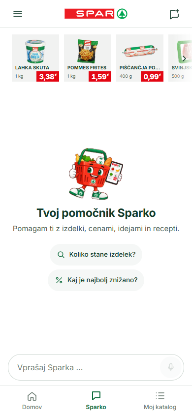
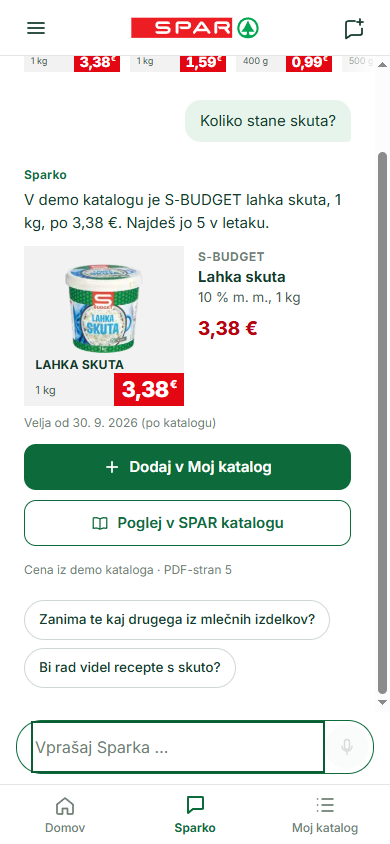
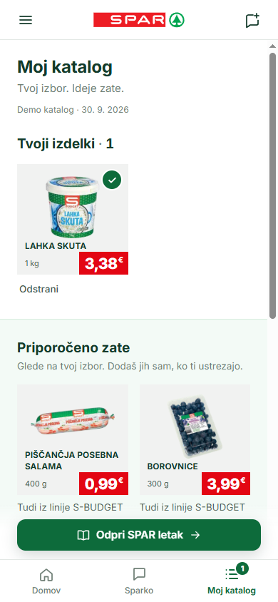
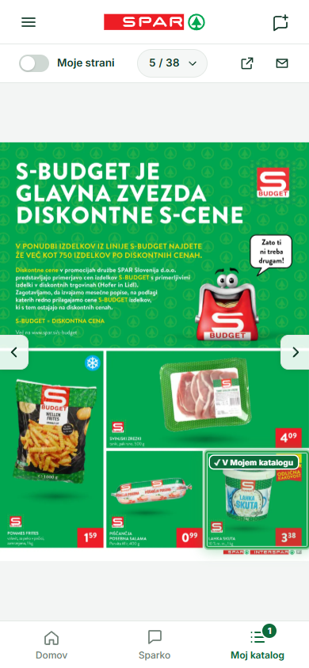

<div align="center">

# SPARko

### AI-powered digital catalog assistant for SPAR

SPARko turns a printed promotional leaflet into an interactive shopping experience.<br>
Ask in plain Slovenian, get verified prices, build your own catalog and jump straight from the conversation to the exact product in the original leaflet.

<br>

<table>
  <tr>
    <td align="center"></td>
    <td align="center"></td>
    <td align="center"></td>
    <td align="center"></td>
  </tr>
  <tr>
    <td align="center"><sub><b>Ask Sparko</b></sub></td>
    <td align="center"><sub><b>Verified product card</b></sub></td>
    <td align="center"><sub><b>Moj katalog</b></sub></td>
    <td align="center"><sub><b>Highlighted in the leaflet</b></sub></td>
  </tr>
</table>

</div>

---

## What is SPARko?

SPARko is a mobile-first **prototype** of a conversational shopping assistant built on top of a real SPAR Slovenija promotional leaflet (catalog 40/26, valid from 30 Sep 2026).

Instead of flipping through 38 pages of a PDF, shoppers talk to **Sparko**: they ask what something costs, what's discounted, what to cook, or what fits a budget. Every answer is backed by structured catalog data, every product can be saved to a personal **Moj katalog**, and every product links back to its exact spot in the original leaflet.

## Why SPARko is different

This is not a chatbot placed next to a PDF. The assistant, the structured catalog data and the visual leaflet are wired together.

> **Ask:** *"Koliko stane skuta?"*
>
> **→** Sparko answers with a verified product card: S-BUDGET Lahka skuta, 1 kg, **3,38 €**, PDF page 5
> **→** One tap saves it to **Moj katalog**
> **→** *"Poglej v SPAR katalogu"* opens the original leaflet on the right page, with the product visually highlighted

The language model writes the sentence. It never decides the price.

## Key features

| | |
| --- | --- |
| **Natural Slovenian conversation** | Free-form questions with contextual follow-ups and suggested next questions |
| **Verified catalog pricing** | Prices, package sizes, discounts and validity dates come from the catalog data, not from the model |
| **Moj katalog** | Save products from chat or leaflet and get explained recommendations based on your picks |
| **Leaflet navigation** | Jump from any product to its exact location in the original SPAR leaflet |
| **Product highlighting** | Saved products are marked directly on the leaflet pages; save/remove there too |
| **Recipes & budget ideas** | Verified recipes built from leaflet products and budget-aware shopping suggestions |
| **Typo & morphology tolerance** | Handles Slovenian inflection and misspellings (*skuto*, *skute*, *skta* …) |
| **Persistent state** | Saved products and conversations survive a page reload |
| **Responsive, mobile-first UI** | Designed for phones first, works on desktop |
| **Live AI + limited fallback** | If the model is unavailable, search, product cards, saving, recipes and the leaflet keep working |

## AI + verified catalog data

SPARko separates conversational AI from trusted catalog facts.

- The model (Anthropic Claude, server-side only) interprets the question and writes a short natural-language reply.
- **Prices, package sizes, discounts, dates, totals and catalog pages** are inserted from `src/data/catalog.json`, never generated.
- Model output is validated against a schema; it may only reference product IDs that the deterministic search actually retrieved.
- Responses that try to **invent a price** or **falsely claim a product was saved** are rejected, and SPARko falls back to a clearly labelled *limited mode* answer.
- Saving, removing and navigating are application actions; clicking a product never needs the model.

API keys stay on the server. No AI keys are exposed to the browser.

More detail on the data pipeline: [docs/DATA.md](docs/DATA.md) · full QA log: [planning/QA-REPORT.md](planning/QA-REPORT.md)

## Quality

| Check | Result |
| --- | --- |
| Data validation | ✅ PASS (32 products, 38 pages, 3 recipes) |
| TypeScript typecheck | ✅ PASS |
| Lint | ✅ PASS |
| Unit tests (Vitest) | ✅ 153 / 153 |
| E2E tests (Playwright) | ✅ 38 / 38 |
| Production build | ✅ PASS |
| Browser-exposed AI keys | ✅ 0 |

Responsive layout checked at **360 / 390 / 430 px** and desktop.

## Tech stack

- **Next.js 16** (App Router) · **React 19** · **TypeScript**
- **Anthropic SDK** (Claude) for the conversational layer
- **Zod** for schema validation of catalog data and model output
- **Vitest** (unit) · **Playwright** (E2E) · **ESLint**
- Deployed on **Vercel**

## Run locally

Requires Node.js ≥ 20.9.

```bash
npm ci
npm run dev        # http://localhost:3000
```

Without any environment variables SPARko runs in **limited mode** (deterministic search, product cards, Moj katalog, recipes and the leaflet all work). To enable live AI, copy `.env.example` to `.env.local` and set:

| Variable | Purpose |
| --- | --- |
| `ANTHROPIC_API_KEY` | Server-side key for live AI answers |
| `AI_MODEL` | Optional model override (default `claude-haiku-4-5`) |
| `UPSTASH_REDIS_REST_URL`, `UPSTASH_REDIS_REST_TOKEN` | Persistent rate limiting, required for live AI in production |
| `ALLOW_UNLIMITED_AI` | `true` enables live AI in production without rate limiting (private demos only) |

Other scripts: `npm run build`, `npm run lint`, `npm run typecheck`, `npm test`, `npm run test:e2e`, `npm run validate:data`.

## Project status & disclaimer

SPARko is an independent **prototype / showcase implementation**, not an official SPAR product. It uses a historical SPAR Slovenija leaflet (catalog 40/26) as demo data; prices and dates reflect that leaflet, not current in-store prices. SPAR and related brand names belong to their respective owners.
